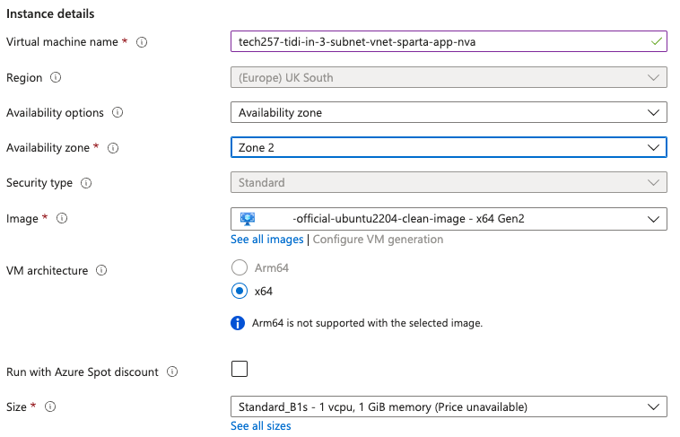

# Database Privacy in Two-Tier Deployment

### [1] Create Virtual Network
   - Desired name:
    <br>
   - In `IP addresses`, add subnets:
    <br>
    <br>
    <br>

  > Note: By enabling private subnet means there will be no outbound access by default. 

  - Add Tags and Create.

### [2] Ready-made image

Create a VM for the database in order to create an image out of it. Otherwise use a ready-made image that serves this purpose.

### [3] Create Virtual Machine for Database
Using the ready-made image, create a virtual machine for the database and have it running.

#### Basics


#### Disks


#### Networking

<br>

> Ensure that there is no Public IP for the database virtual machine. *** Instead we will obtain the private IP address of the database as an environment variable when create the VM for the application.

  - Add Tags and Create.
  
### [4] Create Virtual Machine for Application

#### Basics

- Navigate to desired image and click `Create VM`.

- Ensuring the same Subscription, Resource group, and SSH key configuration, continue with the following:  
  

  

#### Disks


#### Networking


#### Advanced

- Click `Enable user data`
- User data:
    ```
    #!/bin/bash
    export DB_HOST=mongodb://10.0.4.4:27017/posts

    cd /tech257_sparta_app/app/
    pm2 stop all
    pm2 start app.js
    ```

    

> Note: 10.0.4.4:27017 is the Database Private IP address.

  - Add Tags and Create.

#### Results


### [5] Create Network Virtual Appliance using blank image

#### Basics

- Navigate to the clean image and click `Create VM`.

- Ensuring the same Subscription, Resource group, and SSH key configuration, continue with the following:  
  
  <br>
  <br>

#### Disks


#### Networking


#### Advanced

- Click `Enable user data`
- User data:
    ```
    #!/bin/bash

    # Update and upgrade
    sudo apt-get update
    sudo DEBIAN_FRONTEND=noninteractive apt-get upgrade -y
    ```
    

### Summary of Virtual Machines created

#### Database VM:


#### App VM:


#### NVA VM (Network Virtual Applicance VM):


### [6] Test communication between app and database

Set up a link of communication between the app and the database so that we can keep track of what is going on.  

- In a command prompt terminal, use SSH into your App VM.
- Run the ping command using your private IP of the databse: `ping 10.0.4.4`
Need DB private IP:
    <br>
    <br>This sends a little packet of information from the app to the databse to check they can communicate.

### [7] Set up user routing 
Set up the user routing from pubic subnet, through dmz subnet to private subnet.

#### Create Route Table

- In `Route tables` create a route table:
  <br>

- Add Tags and Create.

#### Create a Route

- Go to `Routes` on the LHS navigation bar of Route Table resource > click `Add`.
- Enter the following, then click `Add`.
  <br>


#### Associate the Route Table with the public subnet

- Go to `Subnets` on the LHS navigation bar of Route Table resource > click `Associate` > 
- Enter the following, then click `OK`.
  <br>

- Now have a look at `<Public IP>/posts`:
  <br>

  This also stopped the ping connection that was SSH's into on the App VM:
  <br>

#### Enable IP forwarding on two places...

(a) ... on Azure with NIC

- Go to NVA VM `Network settings`
- Click the `Network interface / IP configuration`, tick te box to Enable IP forwarding, and click `Apply`.
  <br>

(b) ... on the Operating system

- SSH into NVA VM (which has a Public IP address)
- Check if IP forwarding is already enabled: `sysctl net.ipv4.ip_forward`
  <br>

- Uncomment: `sudo nano /etc/sysctl.conf`
<br>
<br>

- Save and Close: `Ctrl + S` > `Ctrl + X`

- Reload the configuration file to apply IP forwarding: `sudo sysctl -p`
  <br>
    
    `Ping` is working again on the app VM:
  <br>

    Website is working again:
    

### [8] Create IP tables using script

- In the NVA VM, create a new script in your home directory: `nano config-ip-tables.sh`

    ```
    #!/bin/bash
    
    # configure iptables
    
    echo "Configuring iptables..."
    
    # Allow traffic within the computer
    sudo iptables -A INPUT -i lo -j ACCEPT
    sudo iptables -A OUTPUT -o lo -j ACCEPT
    
    # Allow already established connections
    sudo iptables -A INPUT -m state --state ESTABLISHED,RELATED -j ACCEPT
    
    # Allow outgoing connections already established
    sudo iptables -A OUTPUT -m state --state ESTABLISHED -j ACCEPT
    
    # Block invalid incoming packets
    sudo iptables -A INPUT -m state --state INVALID -j DROP
    
    # Allow SSH connections
    sudo iptables -A INPUT -p tcp --dport 22 -m state --state NEW,ESTABLISHED -j ACCEPT
    sudo iptables -A OUTPUT -p tcp --sport 22 -m state --state ESTABLISHED -j ACCEPT
    
    # uncomment the following lines if want allow SSH into NVA only through the public subnet (app VM as a jumpbox)
    # this must be done once the NVA's public IP address is removed
    #sudo iptables -A INPUT -p tcp -s 10.0.2.0/24 --dport 22 -m state --state NEW,ESTABLISHED -j ACCEPT
    #sudo iptables -A OUTPUT -p tcp --sport 22 -m state --state ESTABLISHED -j ACCEPT
    
    # uncomment the following lines if want allow SSH to other servers using the NVA as a jumpbox
    # if need to make outgoing SSH connections with other servers from NVA
    #sudo iptables -A OUTPUT -p tcp --dport 22 -m conntrack --ctstate NEW,ESTABLISHED -j ACCEPT
    #sudo iptables -A INPUT -p tcp --sport 22 -m conntrack --ctstate ESTABLISHED -j ACCEPT
    
    # Allow TCP traffic from one subnet to another on specific port
    sudo iptables -A FORWARD -p tcp -s 10.0.2.0/24 -d 10.0.4.0/24 --destination-port 27017 -m tcp -j ACCEPT
    
    # Allow ping traffic between subnets
    sudo iptables -A FORWARD -p icmp -s 10.0.2.0/24 -d 10.0.4.0/24 -m state --state NEW,ESTABLISHED -j ACCEPT
    
    # Set default policies to block incoming and forwarded traffic
    sudo iptables -P INPUT DROP
    sudo iptables -P FORWARD DROP
    
    echo "Done!"
    echo ""
    
    # make iptables rules persistent
    # it will ask for user input by default
    
    echo "Make iptables rules persistent..."
    sudo DEBIAN_FRONTEND=noninteractive apt install iptables-persistent -y
    echo "Done!"
    echo ""
    ```

- Enable permissions: `chmod +x config-ip-tables.sh`

- Run script to make IP rules persistent to survive a reboot: `./config-ip-tables.sh`

  <br>

### Delete Resources


