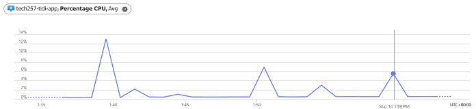
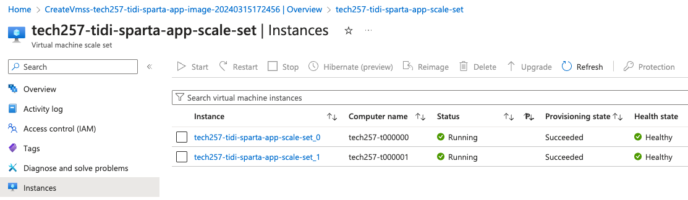

# Auto-Scaling

## Monitoring and Responding to load/traffic

### Worst to Best Practices
- Manual Monitoring: This requires constant human intervention and is prone to errors.
- Threshold-Based Alerts: This provides basic monitoring but lacks scalability and responsiveness. 
- Autoscaling: This automatically adjusts resources based on predefined thresholds, making sure that performance and resource utilisation is optimal.
- Predictive Scaling: This uses historical data and machine learning algorithms to anticipate traffic spikes and scale resources proactively.

## How you setup a dashboard

- Go to Azure portal > Overview > Monitoring tab. 
- Select desired performance metrics.
- Click "Show more charts" to see more.
- Pin the metrics to a new shared dashboard. 
  
  
  

- Create "Create new" > Type: choose "Shared" > Specify Dashboard name, Subscription and Resource group.
- Click "Create and pin".
- Optionally, add existing dashboards to the shared dashboard. 
- Search for "Dashboard hub" in the portal to access the dashboard.
  
  

     *Note: You can also edit these by changing the rate from daily to hourly or every 30 minutes etc.*

## Load Testing
Get VMs to run the app and load test them:

- SSH into the application VM and install Apache Bench: 
  ```
  sudo apt-get install apache2-utils -y
  ```
- Perform load testing with Apache Bench by sending requests with specified concurrency levels:
  ```
  ab -n 1000 -c 100 http://172.166.125.223
  ```
    


Key takeaway(s):
- Combining load testing and theerformance metrics on the dashboard helps to monitor resource usage and application response.
- Therefore, you can load testing data to set thresholds for alerts and trigger notifications for high CPU load.

## Setting Up CPU usage alert

- On Azure Portal, go to the Virtual Machine.
- Click 'Overview'
- Go to Monitoring > Alerts > New alert rule. 
- Choose the appropriate metric (e.g., CPU usage). 
- Set the condition to trigger the alert (e.g., average CPU usage exceeds a certain threshold). 
- Define the criteria for the alert (e.g., average CPU usage for each minute).
- Specify the action group to notify (e.g., email notification). 
- Review and Create.
- Click "Create" to save the alert rule.

Note: the threshold is low enough that the CPU utilisation will trigger an alert when you do heavy load testing and you get an email notification.

### Email Notification

- Wait for the alert condition to be met (e.g., CPU usage exceeds the threshold).
- Check your email inbox for the notification sent by Azure Alert.

## Creating an An Azure VM Scale Set

### Create VM Scale set

- Search in Azure Portal:
  
  

- `+ Create`:

  **Basics:**

  -   Specify your Subscription, Resources and give it a name.
  -   For Availability zone, select Zones 1-3 to ensure high availability.
  -   Select "Uniform" for orchestration mode to ensure identical instances.
  -   Select autoscaling and image:

      

        #### Scaling configuration
        - Instance count - default: 2, min: 2, max: 3 
        - CPU Threshold - 75% (scale out), 25% (scale in)
        - Duration in minutes: 10


  - Choose the instance size: **B1s**
  - Enter username and use existing SSH key.
  - License type: Other.

  **Disks:**

    

  #### Networking:
  - Give name for Virtual network.
  - Give name for Network interface > choose Public subnet > NSG remains basic > Inboud ports: 80 (HTTP) and 22 (SSH).
  - Create and name a load balancer.
  
    

  **Health:**
  
    

    

  **Advanced:**
  
  For user data input:

  ```
  #!/bin/bash
  cd tech257_sparta_app/app/
  pm2 stop all
  pm2 start app.js
  ```
  **Add Tags**

  **Then click `Create`.**

  ### Results

  - Now 'Go to resource' the the scale set resources > Click Instances and you will see 2 instances:

    

    Public IP address for load balancer:

    

    

### Put to the test


- [1] Stop then start both instances:

  

  

  *When both are unhealthy the app won't work.*

- [2] Reimage one of the instances:

  

  *When at least one instance works, the app still runs.*

- [3] Auto-scaling loads a new one after 10 mins:

  


### SSH into them on the terminal

Example Private Key Path: `ssh -i ~/.ssh/yourkey azureuser@4.159.37.42` where you should replace *4.159.37.42* with your own load balancer Public IP.

- SSH into VM by passing in port 50000 to see pm2 running:
  ```
  ssh -i ~/.ssh/yourkey -p 50000 azureuser@4.159.37.42
  ps aux
  ```

- SSH into VM by passing in port 50001 to see pm2 not running:
  ```
  ssh -i ~/.ssh/yourkey -p 50001 azureuser@4.159.37.42
  ps aux
  ```

### Delete resources

Delete in this order:
- Scale set (apply force)
- Load balancer
- Load balancer Public IP
- Network security group