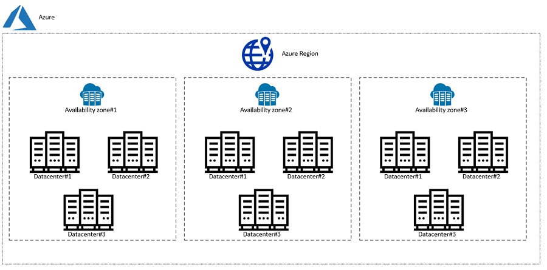

# Understanding Azure Basics
Azure is Microsoft's cloud computing platform. It helps businesses to build, deploy, and manage their applications and services through Microsoft-managed data centers. 

## Azure Regions and Availability Zones

- Azure operates through a global network of regions.
- **Regions** are geographic locations around the world where Azure data centers are located and are independent of each other.
- Within these regions, Azure implements **Availability Zones** (AZs). These are physical data centers within a region with independent power, networking, and cooling infrastructure.

## Azure Structure and Organisation of Resources

Azure has a hierarchical structure for organising resources:

- **Management groups:** Containers that allow you to group multiple subscriptions together for centralised management. They provide a way to apply policies, access controls, and compliance requirements across all subscriptions.
- **Subscriptions:** Provide access to Azure services and resources. They are basically billing containers for Azure usage.
- **Resource Groups:** Containers that hold related resources. They help manage and organise resources. At the resource group level you can apply policies, access controls, and tags.
- **Resources:** Individual services or components that you create and manage in Azure, such as virtual machines, databases, or storage accounts.

## Azure Service Categories

- **Compute** services help you to run and manage applications and workloads in the cloud. You can run applications with virtual machines, containers, or serverless options.
- **Storage** in Azure lets you store data securely with scalable solutions like blob storage (for unstructured data), file storage (for file shares), and managed disks (for virtual machine storage).
- **Networking** in Azure means you can connect resources and extend on-premises networks to Azure using virtual networks (VNets) and VPN gateways (for secure connections).
- **Databases.** Azure has lots of database services, including SQL Database (for relational databases), MySQL, etc.
- **AI and Machine Learning**. In  Azure offers tools and services for building and deploying AI models and solutions.
- **DevOps:** Azure DevOps provides services for continuous integration, delivery, and deployment of applications. This includes Azure Pipelines (for automating build and release pipelines), enabling teams to deliver software faster and with higher quality.

## Azure Pricing Calculator

The Azure Pricing Calculator helps estimate the cost of using specific Azure services based on your requirements, configurations, and usage patterns. It's a tool for planning and budgeting before deploying resources in Azure.

Note: It's not the same as total Cost of Ownership (TCO) which considers all costs associated with owning and operating a solution, including initial setup costs, ongoing maintenance, support, and operational expenses. 