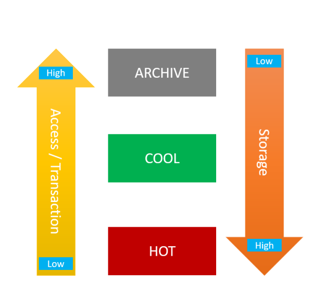
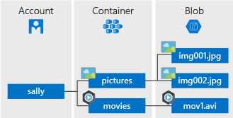

# Blob

## Blob Storage

Blobs are a type of data storage in cloud computing, typically used for storing unstructured data such as images, videos, documents, and other file types. In Azure they are used within Azure Storage accounts. 

They allow you to store and retrieve data efficiently, and can access and manage your files from anywhere with an internet connection.


### Blob storage vs the file system of Linux/Windows/Mac (hierachical file storage)

- Blob storage is a type of object storage used for storing lots of unstructured data in a flat namespace, where each object is accessed via a unique identifier. 
- In contrast, file systems like those in Linux, Windows, and Mac are hierarchical in nature, organising data into directories and subdirectories.

### Pros and cons of blob storage

Advantages:
- Scalability: Blob storage can handle large amounts of data and grow as needed.
- Cost-effectiveness: Users only pay for the storage and bandwidth they use.
- Reliability: Blob storage systems offer redundancy and high availability, ensuring data durability.
- Accessibility: Blob storage can be accessed from anywhere with an internet connection.

Disadvantages:
- Limited file system features: Blob storage lacks some features of traditional file systems, like directory structures and permissions.
- Potential latency: Accessing data over the internet may introduce delays compared to local storage.

### Different tiers (and difference in cost: use Azure Pricing Calculator)

Azure Blob Storage offers different tiers based on the access frequency and availability requirements of the data. These tiers include:

- Hot Access Tier: Optimised for frequently accessed data with slightly higher storage costs but lower access costs.
- Cool Access Tier: Suited for infrequently accessed data with lower storage costs but higher access costs.
- Archive Access Tier: Designed for rarely accessed data with the lowest storage costs but higher retrieval costs and longer access times.



### Parts of Azure blob storage

Azure Blob Storage consists of several components: 

- **Account**: An Azure Storage Account serves as a container for all of your Azure Storage data objects. It provides a unique namespace for your storage resources. 
- **Container**: Within a storage account, you can create one or more containers. Containers act as a logical grouping mechanism for blobs. They help organise blobs and control access permissions. 
- **Blobs**: Blobs are the actual data objects stored in Azure Blob Storage. Blobs are stored within containers and are accessed via unique URLs.



## Understanding Different Redundancy Types

1. **LRS (Locally Redundant Storage)**:
   - Your data is copied three times in one place.
   - It's basic but good if you don't need extra protection.

2. **ZRS (Zone-Redundant Storage)**:
   - Your data is copied across different spots in the same area.
   - It's better than LRS because it guards against one spot failing.

3. **GRS (Geo-Redundant Storage)**:
   - Your data is copied three times nearby and then sent to another area too.
   - It's great for keeping your data safe in case something big happens in one area.

4. **RA-GRS (Read-Access Geo-Redundant Storage)**:
   - Just like GRS but you can still read your data even if one area fails.
   - Useful if you need to access your data during a problem.

5. **GZRS (Geo-Zone-Redundant Storage)**:
   - It's like GRS and ZRS combined, spreading your data across different spots and areas.
   - Offers the highest level of protection.

6. **RA-GZRS (Read-Access Geo-Zone-Redundant Storage)**:
   - Similar to GZRS but still lets you read your data if one area fails.
   - Best if you need your data always available, even during a major issue.

### Cost Differences
   - More protection usually means higher costs because it needs more copies and transfers.
   - Use the Azure Pricing Calculator to see how much each option costs for your needs.

### Comparison at Different Regions:
   - Prices can vary between regions because of how much people want it, how much it costs to set up, and where the data centers are.
   - Some regions might be more popular or have more advanced infrastructure, affecting prices.

### Selecting Redundancy Type in Azure Portal:
   - When making a new storage account, you'll see options to pick the redundancy type.
   - Just follow the steps, choose the one that fits your needs best, and finish creating your account.

## Blob commands

Prerequisite: Install [Azure CLI Ubuntu Debian version](https://learn.microsoft.com/en-us/cli/azure/install-azure-cli-linux?pivots=apt) on Azure VM machine:
     `curl -sL https://aka.ms/InstallAzureCLIDeb | sudo bash`

   - Create storage account: `az storage account create --name [storage-account-name] --resource-group [resource_group] --location uksouth --sku Standard_LRS`
   - Create container:
     `az storage container create --account-name [accountname] --name [containername] --auth-mode login`
   - Delete container:
     `az storage container delete --account-name [accountname] --name [containername] --auth-mode login`
   - Upload a file as a blob in our container:
     `az storage blob upload --account-name [storage-account-name] --container-name [containername]] --name [container-object-name] --file [original-object-name] --auth-mode login`

To clean resources:
```
az storage account delete -n MyStorageAccount -g MyResourceGroup
```
This will prompt you to say yes (`y`) or no (`n`).

## Script to download image from the internet to blob storage: 
`./use-blob.sh`

```
#!/bin/bash

az storage account create --name tech257tidistorage --resource-group tech257 --location uksouth --sku Standard_LRS

az storage container create --account-name tech257tidistorage --name mycontainer --auth-mode login

curl -o cat.jpg https://upload.wikimedia.org/wikipedia/commons/7/74/A-Cat.jpg

az storage blob upload --account-name tech257tidistorage --container-name mycontainer --name azurecat.jpg --file cat.jpg --auth-mode login

if [ ! -f /tech257_sparta_app/app/views/index2.ejs ]; then
    sudo cp /tech257_sparta_app/app/views/index.ejs /tech257_sparta_app/app/views/index2.ejs
fi

BLOB_URL=$(az storage blob url --account-name tech257tidistorage --container-name mycontainer --name azurecat.jpg --auth-mode login)

sudo sed -i "27s|<h2>The app is running correctly.</h2>|& |" /tech257_sparta_app/app/views/index.ejs

az storage account update --name tech257tidistorage --allow-blob-public-access true

sleep 15

az storage container set-permission --account-name tech257tidistorage --name mycontainer --public-access blob
```

Results:
<br>


<!-- ### Script to remove the storage account: 
`./revert.sh` -->
