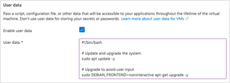
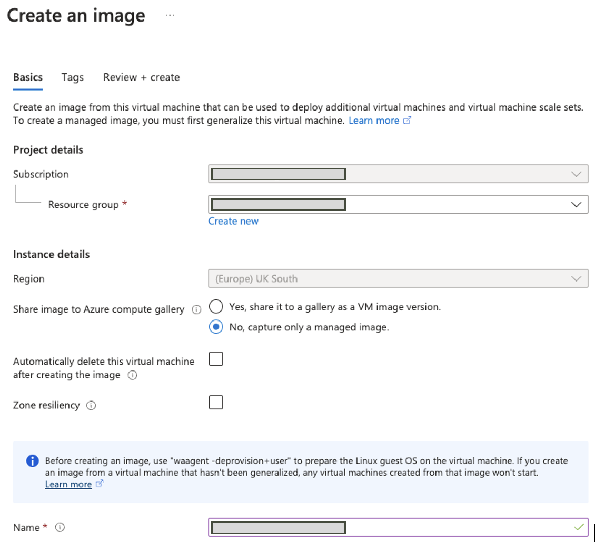

# Hands-On with Azure

## Login to Azure

- Go to [Azure Portal](https://portal.azure.com/).
- Sign in with your Azure credentials. <!--Log in with the permissions you need, not more than that.-->

## SSH

SSH is a way to securely connect to another computer over the internet, as explained in one of my [repositories](https://github.com/teeseira/tech_257_python/blob/main/j_ssh/ssh.md).

Azure supports SSH for accessing and managing virtual machines (VMs) and other resources deployed in the cloud.

### How to Setup an SSH Key on Azure

**Creata a Key Pair on you local machine**

1. Generate SSH key pair in your **.ssh/** directory of your terminal:
    ```bash
    ssh-keygen -t rsa -4096 -C "[your-email]"
    ```
   Give the key a desired **keyname**.

2. View the public key:
    ```bash
    vim ~/.ssh/keyname.pub
    ```

**Create an SSH key on Azure**

3. Add SSH Key to Azure:
   - In Azure Portal, search for "SSH keys" and click `Create`. 
   - Choose Subscription and Resource group.
   - Specify Key pair name.
   - Select `Upload existing public key` for SSH public key source and paste the public key.
   - Click `Review + create`, then `Create`.

   

## Virtual machines
Virtual machines are simulated computers created by software. They allow you to run multiple operating systems on the same physical computer.

   

### How to Create a Virtual Machine

1. Go to Azure Portal and select `Virtual machines`.
2. Click `Create` and choose `Azure virtual machine`.
3. Specify your Subscription and Resource group etc.
4. For instance details:
   - Enter Virtual machine name, choose a Region e.g. `(Europe) UK South`.
   - Specify Availability options, Security type, Image and Size.
5. Set up Administrator account with SSH key.
6. Configure inbound port rules - `HTTPS` and `SSH`.
7. Click `Next` to choose Disk type and `Next` again to choose Networking options.
8. In the `Tags` tab, set Name as "Owner" and Value as your name.
9. Click `Review + create`, then `Create`.

### SSH into your Virtual Machine

Once your VM is created, you can interact with it in the terminal by SSH'ing into it.
1. Click `Connect` on the left-hand side Navigation.
2. Click `Select` for Native SSH.
      
   

3. Where it says `Copy and execute SSH command`, provide the path to your SSH private key file: `~/.ssh/keyname`.
4. Copy the output command provided.
5. Paste the command into the terminal of your local machine to establish an SSH connection. You should be logged in as the Administrator account username you provided when creating a VM.

### Delete a Virtual Machine

1. In the Azure Portal, select `Virtual machines`.
2. Choose the virtual machine you want to delete.
3. Click `Delete`.
4. Confirm the deletion by following the on-screen prompts.

## Automation

Levels of automation ranked lowest to highest:
  - Manual: Start off with manual commands to ensure they work and to avoid user input.
  - Script: Turn all manual commands into a script.
  - User data: Runs a script without needing to SSH in.
  - Image: a copy/snapshot of the VM disk.

By creating an Nginx web server, I will demonstrate the difference between manually running commands and scripting.

### Manually running commands to create a Web Server (Nginx)

- SSH into your virtual machine (VM).

- Check your system knows about the latest available software: `sudo apt update -y`
- Update all the software on your system to the newest versions: `sudo apt upgrade -y`
  
  

- Install the Nginx package (which is used to host websites and web applications on your computer): `sudo apt install nginx -y `
  
  

- Restart Nginx: `sudo systemctl restart nginx`
- See the status of the server: `sudo systemctl status nginx`
  
   

- Test if Nginx is running by retrieving the Public IP address of the VM from Azure Portal and pasting into new browser (ensuring it's for http):

   

- To stop the server running: `sudo systemctl stop nginx`

- Then check the status again: `sudo systemctl status nginx`

- Enable Nginx to start on boot: `sudo systemctl enable nginx`

### Bash scripting to create a Web Server (Nginx)

- SSH into your virtual machine (VM).

- Create and open a new file: `nano [filename].sh`

- Paste the following script content:
  ```bash
  #!/bin/bash
  
  # Update package lists
  sudo apt update -y
  
  # Upgrade installed packages
  sudo apt upgrade -y
   
  # Install the nginx package
  sudo apt install nginx -y
   
  # Starts/restarts nginx
  sudo systemctl restart nginx
  
  # Enables nginx to start on boot
  sudo systemctl enable nginx
  ```
  
- Save the file and close the nano text editor: `Ctrl + S` and
`Ctrl + X`.

- Add execute permissions to the bash script: `chmod +x prov-nginx.sh`

- Run the bash script: `./prov-nginx.sh`

You will have the same results when checking the Public IP.

#### Key takeways:
- Scripting automate tasks without needing to manually click around or type commands every time. It's a lot more efficient. 
- Bash script files end in `.sh` but requires a shebang `!/bin/bash` at the start to be recognised as a Bash script by Linux.
- `#!` is the interpreter, while `/bin/bash` is the path to the bash shell interpreter.

## Manually Deploy App on Azure

I will demonstrate how to make a simple deployment of an application on the Virtual Machine. This app runs on port 3000.

### Step 1: Create Azure VM 

1. Launch a Virtual Machine with *Ubuntu 22.04 LTS* as image, size *B1s*.
2. For Virtual network, create with a public subnet (to allow public facing app) and private subnet (for database).

   
   
4. Set up network security groups for port 22 (SSH), port 80 (HTTP) and port 3000 (Custom).
   
   
5. Add Tags:
   
   

6. Review configurations, and Click `Create`.

### Step 2: App Deployment on Azure
Copy 'app' folder onto VM.

#### Method 1: Get app onto GitHub

1. Create a Git repository  with application code & dependencies. 
2. Then push all the content for the applicaton as a directory onto GitHub as a respository (in this case it's [**tech257_sparta_app**](https://github.com/teeseira/tech257_sparta_app)).
3. SSH into your Azure VM from the terminal: `ssh user@vm_ip`.
4. Then clone the remote GitHub repository into your Azure VM.

#### Method 2: Copy App from Location Machine onto VM

1. Register private key in the terminal.

2. Use `scp` to copy the *app* folder from your local machine to the VM. _This app folder contains the application code and its dependencies._

    ```
    scp -r /path/to/local/app user@vm_ip:/path/to/remote/directory
    ```
3. SSH into the VM.

### Step 3: Install Depenencies and Run the Application

At this stage you should be SSH'd into the VM in the terminal.

- Update & upgrade package list:
  
  ```
  sudo apt update -y
  sudo apt upgrade -y
  ```

- Install and enable web server – nginx version 20.x (automatically installs npm)

   ```
   curl -fsSL https://deb.nodesource.com/setup_20.x | sudo -E bash - &&\
   sudo apt-get install -y nodejs
   ```

- Navigate into the 'app' folder and install  dependencies: 
   ```
   cd tech257_sparta_app/app
   npm install
   ```

- Navigate to the 'app' directory and start the application with `npm start` or `node app.js`.

### Step 3: Check the Website

- Test that the code works by checking your browser with the VM's Public IP and passing in the port 3000.
  
  

- Enter `Ctrl + X` on the terminal to exit, then check browser again.
  
  
  

### Using PM2

You can use PM2 (a process manager) to start your app in the background, as a background process.

- Navigate outside of the application folder (in this case the home directory): `cd ~`
- Install PM2: `sudo npm install pm2@latest -g`
- Verify installation: `pm2 --version`
- Go into app folder: `cd ~/app`
- Start the application with pm2: `pm2 start npm -- start`
  
  

- Test that the code works by checking your browser: **<public IP>:3000**
  
  

- Show a list of the the running processes by PM2: `pm2 list`
- Use PM2 stop process by name or ID: `pm2 stop [PID]`

  

  

## Automate Deployment of App on Azure (with Bash Script)

- Create a bash script, with modified permissions and run it:

  ```
  #!/bin/bash
  
  # Update and upgrade the system
  sudo apt update -y
  sudo apt upgrade -y
  
  # Install nginx
  sudo apt install nginx -y
  sudo systemctl restart nginx
  sudo systemctl enable nginx
  
  # Install nodejs
  curl -fsSL https://deb.nodesource.com/setup_20.x | sudo -E bash - &&\
  sudo apt-get install -y nodejs
  
  # Clone the repo
  git clone https://github.com/teeseira/tech257_sparta_app.git
  cd tech257_sparta_app/app/
  
  # Install npm
  sudo npm install
  
  # Install pm2
  sudo npm install pm2@latest -g
  
  # Start the app
  pm2 start app.js
  ```

- Test it worked on the browser with Public IP and port:
  
  


Note: It's best practice to stop any processes potentially running in the background (`pm2 stop all`) before using pm2 to start the application (pm2 start app.js).

## Reverse Proxy

So far I have configured the web browser to use the public IP address and port (like `Public IP:3000`). With reverse proxy I will only need to enter the public IP address (like `Public IP`).

### Configure Nginx so that it goes to port 3000

As always, I manually ran the commands to see where I want avoid any user prompts or manual intervention. Then I contrustructed the below bash script and ran it:

```
#!/bin/bash

# Update the system
sudo apt update -y

# Upgrade the system to avoid user input
sudo DEBIAN_FRONTEND=noninteractive apt-get upgrade -y

# Install nginx (goes to the root)
sudo apt install nginx -y

# Start and enable nginx
sudo systemctl restart nginx
sudo systemctl enable nginx

# Backup default file if default2 doesn't already exist
if [ ! -f /etc/nginx/sites-available/default2 ]; then
    sudo cp /etc/nginx/sites-available/default /etc/nginx/sites-available/default2
fi
# Check if "proxy_pass" already exists in the line containing "try_files"
sudo sed -i '51s|try_files .*;| proxy_pass http://localhost:3000;|' /etc/nginx/sites-available/default

# Retart nginx
sudo systemctl restart nginx

# Install nodejs and npm
curl -fsSL https://deb.nodesource.com/setup_20.x | sudo -E bash - &&\
sudo apt-get install -y nodejs

# Install PM2
sudo npm install pm2@latest -g

# Clone the repo and navigate into the app folder
git clone https://github.com/teeseira/tech257_sparta_app.git
cd tech257_sparta_app/app/

# Install npm depencies
sudo npm install

# Use PM2 to stop any currently running process, then to start the app
pm2 stop all
pm2 start app.js

```

- Add permissions to the script: e.g. `chmod +x myscript.sh`
- Run the script: e.g. `./myscript.sh`
  
  
  
- Test on webpage without adding port 3000:
  
  

This also worked on a fresh Virtual Machine!

*Key takeaway: With the introduction of the new image and concise user data, the need for the security group to allow inbound traffic for port 3000 is not needed. This is due to the configuration of the Nginx file, which facilitates traffic between port 80 (HHTP) and port 3000 (the app). As a result, accessing the Public IP without specifying port 3000 redirects to port 80, which is managed by Nginx (the web server). Nginx then seamlessly forwards requests to the application via port 3000.*


## Next level of Automation: User Data and Image

- User data are commands that help to automate tasks like software installation, configuration, and system setup. 
- You can pass in a User data to a virtual machine instance during its creation. It allows you to customise the behavior of a virtual machine at boot time without manual intervention.

### Automate app deployment with user data

1. Create Virtual Machine. Configure it like the below and fill in the grey-coloured fields:
   - Basics:
      <br>
      
      
   
      > Choose an image that uses **Ubuntu 22.04 LTS**.
   
   - Disks:
  
      

   - Networking: Choose public-subnet (10.0.2.0/24) > Public IP is automatically created > NSG should allow ports 22 (SSH), 80 (HTTP) and 3000 (Custom) > Tick box for **Delete public IP and NIC when VM is deleted**.
   - Advanced: 
  
       
      
      > For user data, use the script used for reverse proxy (in the previous topic discussed).
   - Tags
   - 'Review + Create' > 'Create'.

   
2. Check Public IP in separate browser (no need to SSH in).
   
    


## Images (further level of Automation)

- Images are used in Azure to provide a new virtual machine with an operating system. An image might also have one or more data disks. An image source can be a snapshot of an existing Azure VM that is generalised.
- Choosing the right image when creating a virtual machine (VM) on Azure is important because different images come with different pre-installed software, settings, and configurations to support your application, saving time and effort in setup and configuration.

### Create an image

The prerequisite here is having [Azure CLI](https://learn.microsoft.com/en-us/cli/azure/install-azure-cli) installed.
- Create a Virtual Machine (similar to the detailed instructions in the previous topic above).
- SSH into the VM:
  - Have the app server actively running (run `pm2 app.js` in the 'app' folder if necessary).
  - In any directory, prepare the VM to be imaged by deprovisioning it: `sudo waagent -deprovision+user && yes`.
  - Log out of VM (run `exit`) then log in using Azure CLI (run `az login`).
  - Stop the VM: `az vm deallocate --resource-group <yourResourceGroup>> --name <yourVMName>`
  - Generalise VM: `az vm generalize --resource-group <yourResourceGroup>> --name <yourVMName>`
- Return to Azure Portal > click `Overview` from the VM > click `Capture` > Configure image details.

- Create a VM from the new image:

  
  
  > Fill in the grey-coloured fields.

  Key takeaway: I was able to create a fresh Virtual Machine using this VM to test that my Bash scripts and they successfully worked. The Git repsoitory was in the root directory when I SSH'd into the VM.

#### Images vs User Data

- User data scripts are executed only once during VM initialisation. You can include commands in the user data script to automate tasks, such as installing applications or configuring settings, so that the VM is ready for use without manual intervention.
- Images are pre-configured templates that serve as the basis for creating VM instances. They contain the operating system and potentially other software configurations. Once you create a VM from an image, you can use that VM multiple times, and each instance will have the same starting configuration as defined by the image.

### Automate app deployment using image just created and short user data

- Create a VM, using image just created and with the following as user data:
  
  
  
  ```
  #!/bin/bash
  
  # Navigate into app directory (should go to root)
  cd /tech257_sparta_app/app/
  
  # Use PM2 to stop any currently running processes, then to start the app
  pm2 stop all
  pm2 start app.js
  ```
  
- Public IP address now works from my new image and short user data:
  
  

Key takeaway: User data is sometimes only needed in shorter form. This is the case when an image already contains the desired configuration and software setup. When you create an image of a VM, you capture its entire state, including the operating system, installed software, and configuration settings. So shorter user data is needed because some things are already applied in the iamge.

## Two-Tier Application

A two-tier application is a type of software system that consists of two main parts or layers:

- **User Interface Layer:** This layer is where users interact with the application. In this case it includes the web browser that users will use to view information, and interact with the system.

- **Backend Layer:** This layer handles the processing and storage of data. In this case it includes the database that stores and retrieves data.

### Database
Databases are used to store and retrieve data quickly. MongoDB is a type of database that stores data in a flexible and scalable format. The default port for MongoDB is 27017.

### Automate database VM

    ```
    #!/bin/bash

    # Update and upgrade
    sudo apt-get update
    sudo DEBIAN_FRONTEND=noninteractive apt-get upgrade -y

    # Get a GnuPG key
    sudo apt-get install gnupg curl
    curl -fsSL https://www.mongodb.org/static/pgp/server-7.0.asc | sudo gpg -o /usr/share/keyrings/mongodb-server-7.0.gpg --dearmor

    # Create a source list file
    echo "deb [ arch=amd64,arm64 signed-by=/usr/share/keyrings/mongodb-server-7.0.gpg ] https://repo.mongodb.org/apt/ubuntu jammy/mongodb-org/7.0 multiverse" | sudo tee /etc/apt/sources.list.d/mongodb-org-7.0.list

    # Update to get the latest mongodb packages
    sudo apt-get update -y

    # Install MongoDB 7.06
    sudo apt-get install -y mongodb-org=7.0.6 mongodb-org-database=7.0.6 mongodb-org-server=7.0.6 mongodb-mongosh=2.1.5 mongodb-org-mongos=7.0.6 mongodb-org-tools=7.0.6

    # Create backup for mongodb
    sudo cp /etc/mongod.conf /etc/mongod2.conf

    #Configure Mongodb's bindiP
    sudo sed -i 's@127.0.0.1@0.0.0.0@' /etc/mongod.conf

    # Start and enable the inactive mongod service 
    sudo systemctl start mongod
    sudo systemctl enable mongod

    ```

    <!-- Note: you can SSH into database VM to check status: sudo systemctl status mongod -->

  <!--Manually on App VM:
  
  # Go to app folder:
  cd /tech257_sparta_app/app
  
  # Kill PM2 processes:
  sudo kill -SIGTERM $(ps aux | grep '[p]m2' | awk '{print $2}')
  
  # Run commands:
  sudo npm install
  sudo -E npm install
  sudo -E npm start -->
  
### Results

Result of the two-tier application after passing in the below in app's user data:

  ```
  # Export Database Private IP address
  export DB_HOST="mongodb://10.0.3.4:27017/posts"
  ```


<br><br>

- SSH into Database VM to check status:
  
  

## Add Blob Image to the Application

`./use-blob.sh`

Script to download image from the internet to blob storage: 
```
#!/bin/bash

az storage account create --name tech257tidistorage --resource-group tech257 --location uksouth --sku Standard_LRS

az storage container create --account-name tech257tidistorage --name mycontainer --auth-mode login

curl -o cat.jpg https://upload.wikimedia.org/wikipedia/commons/7/74/A-Cat.jpg

az storage blob upload --account-name tech257tidistorage --container-name mycontainer --name azurecat.jpg --file cat.jpg --auth-mode login

if [ ! -f /tech257_sparta_app/app/views/index2.ejs ]; then
    sudo cp /tech257_sparta_app/app/views/index.ejs /tech257_sparta_app/app/views/index2.ejs
fi

BLOB_URL=$(az storage blob url --account-name tech257tidistorage --container-name mycontainer --name azurecat.jpg --auth-mode login)

sudo sed -i "27s|<h2>The app is running correctly.</h2>|& |" /tech257_sparta_app/app/views/index.ejs

az storage account update --name tech257tidistorage --allow-blob-public-access true

sleep 15

az storage container set-permission --account-name tech257tidistorage --name mycontainer --public-access blob
```

> The script creates a storage account, container and uploads cat image blob, makes the blob public, modifies the homepage index file to use the new blob, then runs the app.

Results:


<!-- ### Script to remove the storage account: 
`./revert.sh` 
Script to change everything back to the way it was on the home page and re-run the app, then delete the storage account.
-->