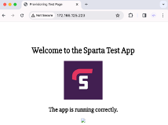

## Blobs

Blobs are a type of data storage in cloud computing, typically used for storing unstructured data such as images, videos, documents, and other file types. In Azure they are used within Azure Storage accounts. 

They allow you to store and retrieve data efficiently, and can access and manage your files from anywhere with an internet connection.

### Manually creating and blobs using AWS CLI

Prerequisite: Install [Azure CLI Ubuntu Debian version](https://learn.microsoft.com/en-us/cli/azure/install-azure-cli-linux?pivots=apt) on Azure VM machine:
     `curl -sL https://aka.ms/InstallAzureCLIDeb | sudo bash`

   - Create storage account: `az storage account create --name [storage-account-name] --resource-group [resource_group] --location uksouth --sku Standard_LRS`
   - Manually download image from the internet to blob storage: `./use-blob.sh`
   - To remove the storage account: `./revert.sh`
   - Create container:
     `az storage container create --account-name [accountname] --name [containername] --auth-mode login`
   - Delete container:
     `az storage container delete --account-name [accountname] --name [containername] --auth-mode login`
   - Upload a file as a blob in our container:
     `az storage blob upload --account-name [storage-account-name] --container-name [containername]] --name [container-object-name] --file [original-object-name] --auth-mode login`
- To clean resources: `az storage account delete -n MyStorageAccount -g MyResourceGroup`. This will prompt you to say yes (`y`) or no (`n`).

#### Incomplete Blob Script

```
#!/bin/bash

# Create storage account
az storage account create --name tech257tidistorage --resource-group tech257 --location uksouth --sku Standard_LRS

# Create container
az storage container create --account-name tech257tidistorage --name mycontainer --auth-mode login

# Get picture and upload
curl -o cat.jpg https://upload.wikimedia.org/wikipedia/commons/7/74/A-Cat.jpg
az storage blob upload --account-name tech257tidistorage --container-name mycontainer --name azurecat.jpg --file cat.jpg --auth-mode login

sudo sed -i "27s|<h2>The app is running correctly.</h2>|& |" /tech257_sparta_app/app/views/index.ejs

# Public access (Not Working)
az storage container set-permission --name mycontainer --account-name tech257tidistorage --auth-mode login --public-access blob

# Sleep command
sleep 15

```

Broken image of blob:

   

Troubleshooting: `az storage container set-permission --name mycontainer --account-name tech257tidistorage --auth-mode login --public-access blob`