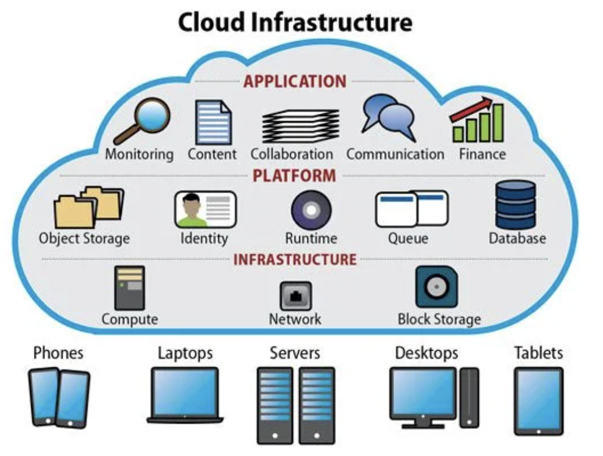

# Cloud Computing 

Cloud computing is like renting computer resources (like storage space, processing power, and software) over the internet instead of buying and managing them yourself.

### History Cloud Computing

- **1960s**: People started thinking about cloud computing.
- **1990s**: Companies offered virtual private network (VPN) services.
- **2006**: Amazon started offering Elastic Compute Cloud (EC2), kicking off the modern cloud era!
- **2008**: Google made Google App Engine.
- **2010**: Microsoft made Azure.
- **Now**: Lots of businesses use cloud computing all over the world.

### Cloud Computing uses
With cloud computing, you can...
- Host websites
- Build and run applications
- Store data
- Analyse data
- Use with advanced technologies like AI

**What's the Cloud Tax?**
- Servers
- Storage
- Network usage
- Databases
- AI tools etc.

**Cloud Computing as a Business Model**

No more buying and managing your own hardware. With cloud computing, businesses only pay for what they use. This saves money and allows for more flexibility.

## Cloud Models
- Public Cloud: Computing services offered by third-party providers over the internet to the general public.
- Private Cloud: Computing services used by a single organisation, often managed within their own data centers.
- Hybrid Cloud: A combination of both public and private cloud services, allowing data and applications to be shared between them.
- Multi-Cloud: Using services from multiple cloud providers to avoid vendor lock-in and leverage the strengths of each provider.

## Cloud Services

### On-Premise Service
- You own and manage all hardware and networking equipment. E.g. Purchasing and maintaining servers, switches, and routers

- You install and maintain software locally on your own servers or computers. E.g. Installing and updating operating systems, applications, and security patches on your company's computers.

### Infrastructure as a Service (IaaS)
You manage the applications, data, runtime, middleware, and operating system. E.g. Renting servers and storage. 

### Platform as a Service (PaaS)
You only manage the applications and data. E.g. Renting a platform to develop and deploy apps. 

### Software as a Service (SaaS)
You don't have to worry about any of the underlying infrastructure or maintenance. E.g. Using software over the internet without installing it locally. 

### Function as a Service (FaaS) or Serverless Computing
You write code in functions that respond to events, and the cloud provider automatically runs them for you, scaling as needed. E.g. Running code without managing servers. 

## Benefits and Drawbacks of Cloud Services

### Benefits:
- Cost Savings: Cloud is often cheaper because you only pay for what you use, avoiding large upfront costs.
- Flexibility: You can easily adjust resources to match your needs, whether you're growing or scaling back.
- Scalability: You can easily scale resources up or down based on demand without crashing or slowing down. 
- Collaboration: Cloud tools make it easy for teams to work together from anywhere.

### Drawbacks:
- Security Risks: Storing data online means it could be vulnerable to hackers if not properly protected. 
- Internet Reliance: Cloud services rely on internet connections. If the internet goes down, this affects your access to cloud resources.
- Possible Downtime: Technical problems or maintenance in the cloud can disrupt your work. 

**Takeaway:** Even though there are many benefits of cloud computing, it's important to minimise the drawbacks such having backup plans in case of downtime.

## OpEx vs CapEx

- Operational expenses are like paying for things as you use them. For example, when you use cloud services, you pay for the resources you consume each month.
- Capital expenses involve big investments upfront. Instead of paying as you go, you buy something all at once.

Think of it like choosing between Netflix and buying DVDs.

## Cloud Service Providers 

### The Top Cloud Providers
1. Amazon Web Services (AWS): Big range of services, global reach. 
2. Microsoft Azure: Works well with Microsoft products, good for big companies. 
3. Google Cloud Platform (GCP): Good for data analytics and machine learning.

### Market Share

AWS remains the dominating cloud provider, however Azure is becoming more popular overtime. **Why?**

- Azure easily integrates with other Microsoft products and services, such as Office 365. 
- Therefore organisations already invested in the Microsoft ecosystem may prefer Azure.

## The 4 Pillars of DevOps
1. Culture: Team collaboration and communication.
    <!-- E.g. Encouraging cross-functional teams to work together and share knowledge to achieve common goals.-->
2. Automation: Automating tasks like deployment. 
    <!-- E.g. E.g. Implementing continuous integration and continuous deployment (CI/CD) pipelines to automate software delivery processes. -->
3. Measurement: Monitoring and analysing performance. 
    <!-- E.g. Using monitoring tools to track system metrics, analyse trends, and identify areas for improvement.-->
4. Sharing: Sharing knowledge and experiences within the team.
    <!-- E.g. Hosting regular knowledge-sharing sessions, documenting best practices, and fostering a culture of learning and mentorship.-->

### How do they link into the Cloud?
DevOps practices help teams work better together and automate processes, which fits well with the flexibility and scalability of cloud computing.

**Takeaway:** DevOps + Cloud = Faster delivery, higher quality, and improved efficiency in software development and deployment.

## Case studies
   - Netflix: Moved everything to AWS for better scalability.
   - Airbnb: Uses AWS for quick growth.
   - Capital One: Shifted to AWS for improved security and innovation.

