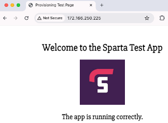

# Deploy app VM image using short user data

### Image

Application of the previously created image:


### User data

- Because of the previously created image, which contains all the installed dependencies, only a small amount of user data is needed when creating a Virtual Machine.

- The below user data navigates into the app folder, stops any previous pm2 processes, and then uses pm2 to run the app:
    ```
    #!/bin/bash
    cd tech257_sparta_app/app
    pm2 stop app.js
    pm2 start app.js
    ```

### Virtual Machine's Public IP
- The result of creating a Virtual Machine using the image and shorter user data:
  
  