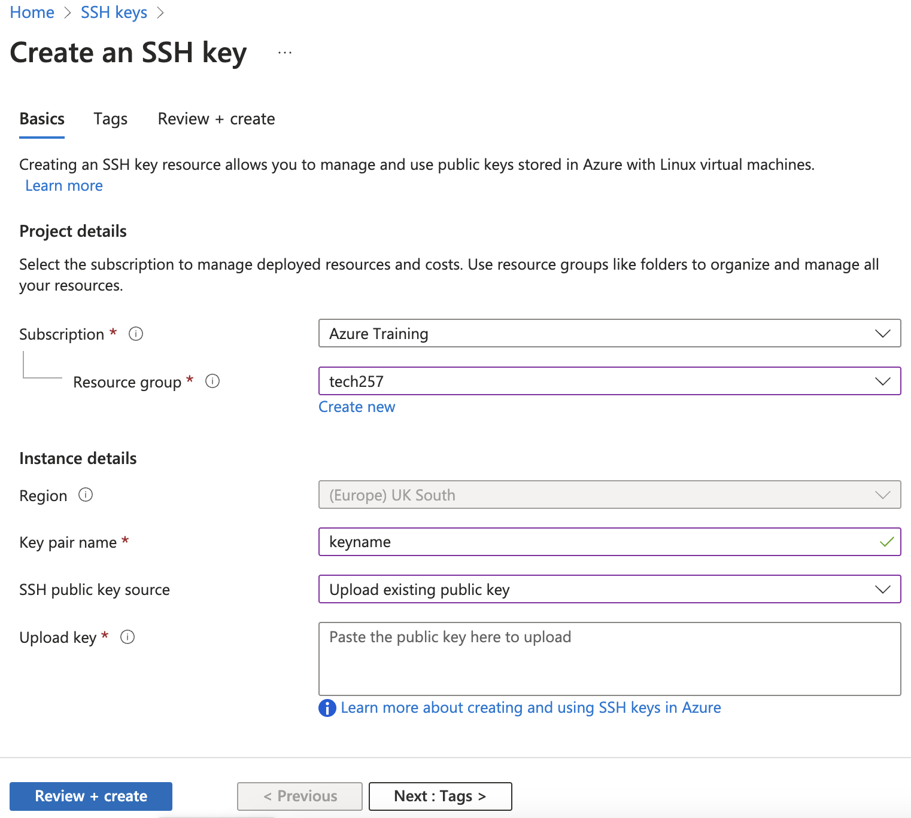

# Azure

## Virtual machines
Virtual machines are simulated computers created by software. They allow you to run multiple operating systems on the same physical computer.

   

## How To...

### Login to Azure

- Go to [Azure Portal](https://portal.azure.com/).
- Sign in with your Azure credentials. <!--Log in with the permissions you need, not more than that.-->

### Create a Virtual Network
1. Search for "Virtual networks" in Azure Portal and select it.
2. Click `Create` and specify your Subscription, Resource group, Virtual network name, and Region.
3. In the `Tags` tab, add a name and value for `All resources selected`.
4. Click `Review + create`, then `Create`.

### Setup SSH Key on Azure

1. Generate SSH key in your **.ssh/** directory of your terminal:
    ```bash
    ssh-keygen -t rsa -b 2048 -C "[your-email]"
    ```
   Give the key a desired **keyname**.

2. Copy the public key:
    ```bash
    cat ~/.ssh/keyname.pub
    ```

3. Add SSH Key to Azure:
   - In Azure Portal, search for "SSH keys" and click `Create`. 
   - Choose Subscription and Resource group.
   - Specify Key pair name.
   - Select `Upload existing public key` for SSH public key source and paste the public key.
   - Click `Review + create`, then `Create`.
      
      

### Create a Virtual Machine

1. Go to Azure Portal and select `Virtual machines`.
2. Click `Create` and choose `Azure virtual machine`.
3. Specify your Subscription and Resource group.
4. For instance details:
   - Enter Virtual machine name, choose a Region e.g. `(Europe) UK South`.
   - Specify Availability options, Security type, Image and Size.
5. Set up Administrator account with SSH key.
6. Configure inbound port rules - `HTTPS` and `SSH`.
7. Click `Next` to choose Disk type and `Next` again to choose Networking options.
8. In the `Tags` tab, set Name as "Owner" and Value as your name.
9. Click `Review + create`, then `Create`.

### SSH into your Virtual Machine

1. Click `Connect` on the left-hand side Navigation.
2. Click `Select` for Native SSH.
      
   

3. For `Copy and execute SSH command`, provide the path to your SSH private key file: `~/.ssh/keyname`.
4. Copy the output command provided.
5. Paste the command into the terminal of your local machine to establish an SSH connection. You should be logged in as the Administrator account username you provided when creating a VM.
      
      

### Delete a Virtual Machine

1. In the Azure Portal, select `Virtual machines`.
2. Choose the virtual machine you want to delete.
3. Click `Delete`.
4. Confirm the deletion by following the on-screen prompts.
