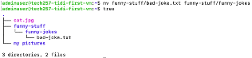

# Linux

## Linux Commands

### General Commands

- `ls`: List files and directories.
- `ls -l`: List files in long format (you can see permissions).
- `ls -a`: List all files, including hidden files.
- `history`: Shows command history.
- `history -c`: Clears command history.
- `!5`: Runs command number 5 from history.

### When SSH'd into a Virtual Machine
- `ssh -i ~/.ssh/[keyname] adminuser@[public-ip]`: Logs back into a remote server.
- `exit`: Terminates the current session.  

    

- `cat /etc/shells`: Displays list of available shells.
- `ps -p $$`: See what shell you're running on.

### File and Directories

- `cd .`: Moves to the current directory.
- `cd ..`: Moves to the parent directory.
- `cd`: Moves to the home directory.
- `cd ~`: Moves to the home directory.
- `cd /`: Moves to the root directory.
- `mkdir`: Creates a directory.
- `rm -d`: Removes an empty directory.
- `rm -r`: Removes a directory and its contents.
- `touch`: Creates an empty file.
- `rm`: Delete a file.
- `curl`: Downloads from the web.
- `file`: Determines the type of a file.
- `cp`: Copies files or directories.
- `mv`: Moves or renames files or directories.
- `nano`: A text editor for creating or editing files.
- `tree`: Displays the directory structure recursively.

**How to apply some commands:**

Referencing to this first tree, assuming we remain on the home directory (`~`):    

  - To move **chicken-joke.txt** to **funny-stuff** directory:
  `mv chicken-joke.txt funny-stuff`

  - To move **chicken-joke.txt** to **funny-jokes** directory:
  `mv chicken-joke.txt funny-stuff/funny-jokes`

Referencing to this second tree, assuming we remain in the `funny-jokes` directory:

 - To move **chicken-joke.txt** back to **funny-jokes** directory:
  `mv funny-stuff/chicken-joke.txt .`

  - To move **chicken-joke.txt** back to **funny-stuff** directory:
  `mv funny-stuff/chicken-joke.txt ..`

  - To rename **chicken-joke.txt** with new name **bad-joke.txt**:
  
    `cd ~/funny-stuff/funny-jokes/`
    
    `mv chicken-joke.txt bad-joke.txt`
    
    

### Displaying file contents

- `head`: Displays the beginning of a file.
- `tail`: Displays the end of a file.
- `nl`: Displays line numbers in a file.
- `cat [file-name] | grep [phrase]`: Searches for a phrase in a file.

### System tasks

- `sudo apt update -y`: Updates package lists.
- `sudo apt upgrade -y`: Upgrades installed packages.
- `sudo apt install tree`: Installs the tree package.

## Key Takeaways

- Linux determines a file type based on its content rather than its extension.
- Superuser privileges can be obtained using the `sudo` command.
- Absolute paths provide the full directory structure of a file or directory.

