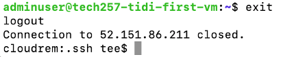
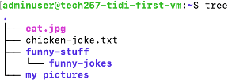
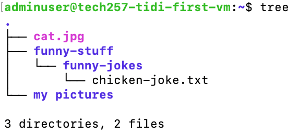
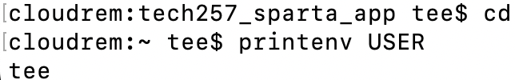
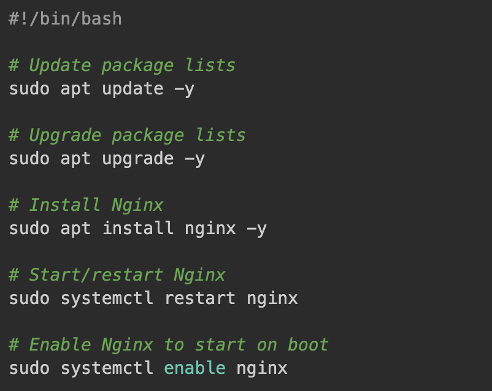
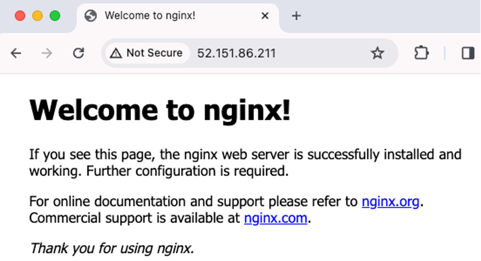

# Linux

### Shell

- The shell is a command-line interface program, running behind the terminal, that interprets and executes commands entered by the user.
- The shell serves as the **interface** for interacting with the Linux operating system. So it's like a **mediator** between the user and the Linux kernel.

### Linux
- Linux is an **operating system** similar to Windows or macOS, but it's open-source, meaning its source code is freely available to the public.
- Users can **interact with** Linux through the shell to run commands, execute scripts, manage files and directories, and perform various system operations.
- Linux supports many shell environments such as Bash.
  
## Linux Commands

### General Commands

- `ls`: List files and directories.
- `ls -l`: List files in long format (you can see permissions).
- `ls -a`: List all files, including hidden files.
- `history`: Shows command history.
- `history -c`: Clears command history.
- `!5`: Runs command number 5 from history.

### When SSH'd into a Virtual Machine
- `ssh -i ~/.ssh/[keyname] adminuser@[public-ip]`: Logs back into a remote server.
- `exit`: Terminates the current session.  

    

- `cat /etc/shells`: Displays list of available shells.
- `ps -p $$`: See what shell you're running on.


### File and Directories

- `cd .`: Moves to the current directory.
- `cd ..`: Moves to the parent directory.
- `cd`: Moves to the home directory.
- `cd ~`: Moves to the home directory.
- `cd /`: Moves to the root directory.
- `mkdir`: Creates a directory.
- `rm -d`: Removes an empty directory.
- `rm -r`: Removes a directory and its contents.
- `touch`: Creates an empty file.
- `rm`: Delete a file.
- `curl`: Downloads from the web.
- `file`: Determines the type of a file.
- `cp`: Copies files or directories.
- `mv`: Moves or renames files or directories.
- `nano`: A text editor for creating or editing files.
- `tree`: Displays the directory structure recursively.

**How to apply some commands:**

Referencing to this first tree, assuming we remain on the home directory (`~`):    




  - To move **chicken-joke.txt** to **funny-stuff** directory:
  `mv chicken-joke.txt funny-stuff`

  - To move **chicken-joke.txt** to **funny-jokes** directory:
  `mv chicken-joke.txt funny-stuff/funny-jokes`

Referencing to this second tree, assuming we remain in the `funny-jokes` directory:



 - To move **chicken-joke.txt** back to **funny-jokes** directory:
  `mv funny-stuff/chicken-joke.txt .`

  - To move **chicken-joke.txt** back to **funny-stuff** directory:
  `mv funny-stuff/chicken-joke.txt ..`

### Displaying file contents

- `head`: Displays the beginning of a file.
- `tail`: Displays the end of a file.
- `nl`: Displays line numbers in a file.
- `cat [file-name] | grep [phrase]`: Searches for a phrase in a file.

### System tasks

- `sudo apt update -y`: Updates package lists.
- `sudo apt upgrade -y`: Upgrades installed packages.
- `sudo apt install tree`: Installs the tree package.


## Variables

Variables are values stored in memory and managed by the operating system.

### Creating Variables

- When creating a variable, they must be in CAPITALS.
- To create a variable in the terminal, use the syntax `VARIABLE_NAME=value`.
- To print out the variable, use the syntax `printenv VARIABLE_NAME` where output should be `value`.
  


#### Local Variables

To create a local variable:

```bash
MYNAME=tee
echo $MYNAME
```

Output:

```
tee
```

#### Environment Variables

To create an environment variable:

```bash
export MYNAME=tee_is_persistent
printenv MYNAME
```

#### Persistent Environment Variables

To make an environment variable persist across sessions, you can add it to the `.bashrc` file:

```bash
nano ~/.bashrc
```

Add the following line to the bottom of the file:
```bash
export MYNAME=tee_is_persistent
```

Save and exit the editor: `Ctrl + S` and `Ctrl + X`.

To apply the changes without logging out and logging back in:
```bash
source ~/.bashrc
```

## Scripting with Bash

Scripting allows you to automate tasks or perform specific actions on your computer without the need for manual intervention. It's like giving the computer a set of instructions to follow in order to accomplish a task efficiently.

### Creating and Running a Provision Ngnix script

- Open your terminal and log into your virtual machine (VM) using SSH.
- Create a bash script file named **prov-nginx.sh**: `touch prov-nginx.sh`

- Open the file in a text editor: `nano prov-nginx.sh`
- Add the following content to the script file to install and configure an Nginx web server:
    
- Save and close the file: `Ctrl + S` and `Ctrl + X`

#### Running the script

- To execute the bash script, navigate to the directory containing the script and run: `./prov-nginx.sh`
- Make sure to grant execute permissions to the script: `chmod +x prov-nginx.sh`


#### Managing the server status
- To check the status of the Nginx server: `sudo systemctl status nginx`
- To view the Nginx server running, get the public IP address of your VM from the Azure Portal and paste it into a web browser.
  
    
- To stop the Nginx server: `sudo systemctl stop nginx`

## Processes

- Every process has a unique process ID (pid).
- TTY is the terminal associated with a process, but not all processes have a terminal.
- There are two types of processes - system processes or user processes.

### Process commands

- `ps`: Gives a snapshot of all user processes currently running.
- `ps -e`: Shows all processes.
- `ps aux`: Shows detailed information about all processes.
- `top`: Used for real-time monitoring, ranked by CPU usage.
- `sleep 3`: Puts a process to sleep for 3 seconds.
- `sleep 5000 &`: Runs a process in the background for 5000 seconds.
- `jobs`: Lists background processes.
- `kill [PID]`: Gracefully terminates a process by its process ID.
- `kill -9 [PID]`: Forcefully terminates a process, may create zombie processes.

#### Additional information
- `pm2` is a process manager used for managing processes for many applications such as Node.js apps.
- Some processes create other processes.
- Killing a parent process may leave child processes as zombie processes.


 