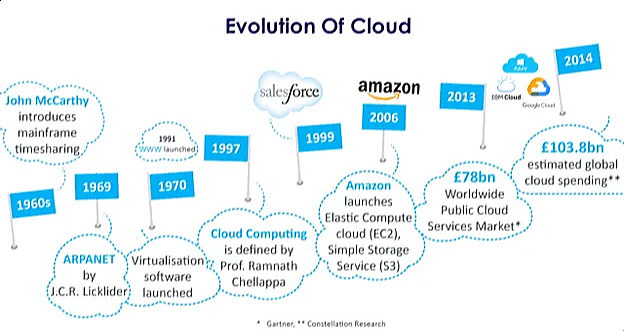
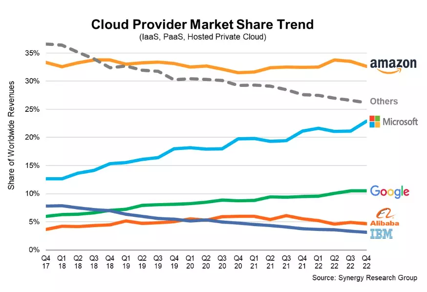

## Cloud Computing
Cloud computing is like renting computer resources (like storage space, processing power, and software) over the internet instead of buying and managing them yourself.

### History Cloud Computing

- **1960s**: People started thinking about cloud computing.
- **1990s**: Companies offered virtual private network (VPN) services.
- **2006**: Amazon started offering Elastic Compute Cloud (EC2), the start of modern cloud computing.
- **2008**: Google made Google App Engine.
- **2010**: Microsoft made Azure.
- **Now**: Lots of businesses use cloud computing all over the world.

### Use cases
- Host websites
- Build and run applications
- Store data
- Analyse data
- Use with advanced technologies like AI

## Cloud Models
- Public Cloud: Computing services offered by third-party providers over the internet to the general public.
- Private Cloud: Computing services used by a single organisation, often managed within their own data centers.
- Hybrid Cloud: A combination of both public and private cloud services, allowing data and applications to be shared between them.
- Multi-Cloud: Using services from multiple cloud providers to avoid vendor lock-in and leverage the strengths of each provider.

## Cloud Services

### Infrastructure as a Service (IaaS)
- Renting servers and storage. 
- You manage the applications, data, runtime, middleware, and operating system.

### Platform as a Service (PaaS)
- Renting a platform to develop and deploy apps. 
- You only manage the applications and data. 

### Software as a Service (SaaS)
- Using software over the internet without installing it locally. 
- You don't have to worry about any of the underlying infrastructure or maintenance.

### Function as a Service (FaaS) or Serverless Computing
- Running code without managing servers. 
- You write code in functions that respond to events, and the cloud provider automatically runs them for you, scaling as needed.

## Pros and Cons of Cloud
   - Advantages: 
     - Cheaper
     - Flexible
     - Can easily scale
     - Easy collaboration
   

   - Disadvantages: 
     - Security concerns
     - Internet dependency
     - Potential downtime

## OpEx vs CapEx
   - Operational Expenses: These are the variable expenses like rent or cloud services. You pay for these expenses as you use them.
   - Capital Expenses: These are the upfront costs for physical assets like servers.

## Cloud Service Providers 

### The Top Cloud Providers
1. Amazon Web Services (AWS): Big range of services, global reach. 
2. Microsoft Azure: Works well with Microsoft products, good for big companies. 
3. Google Cloud Platform (GCP): Good for data analytics and machine learning.

### Cloud Service Providers Market Share

## The Pillars of DevOps
1. Culture: Team collaboration and communication. 
2. Automation: Automating tasks like deployment. 
3. Measurement: Monitoring and analyzing performance. 
4. Sharing: Sharing knowledge and experiences within the team.

### How do they link into the Cloud?
DevOps practices help teams work better together and automate processes, which fits well with the flexibility and scalability of cloud computing.

## Case studies of businesses migrating to or using the cloud
   - Netflix: Moved everything to AWS for better scalability.
   - Airbnb: Uses AWS for quick growth.
   - Capital One: Shifted to AWS for improved security and innovation.

## How does Cloud Computing work as a business model?
Businesses pay for what they use instead of buying and managing their own hardware, saving money and allowing for more flexibility.

## What do you usually need to pay for when using the cloud?
   - Servers, storage, network usage, and extra services like databases or AI tools.